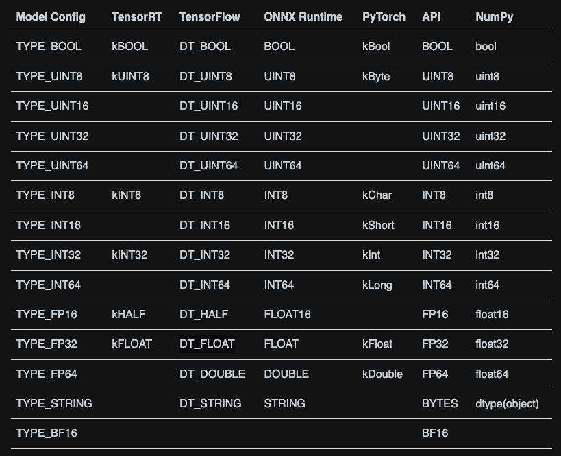

## Summary
[Tutorial](https://towardsdatascience.com/serving-tensorrt-models-with-nvidia-triton-inference-server-5b68cc141d19)

Deploy tensorflow ResNet50 on Docker Triton Server and inference

## BUG
- With batch size > 1 predictions are  difference then batch size = 1

## Steps
### 1. Generate model.onnx 
Run `Tensorflow_CNN_ResNet50.ipynb`

models directory structure

/version is numerically named subdirectory -> usefull for A/B Testing
```
/models
   /model_name
      /version
         config.pbtxt
         model.plan | model.onnx | or other model type
```

### 2.
`docker pull nvcr.io/nvidia/tensorrt:23.01-py3`

### 3. Conversion to TensorRT model using TensorRT Docker 
```diff
! NOT AVAILABLE on non-NVIDIA-GPU env, i.e MacOS m1!!!
```

Convert ONNX model model.onnx -> TensorRT model model.plan

TensorRT with TensorFlow 
https://docs.nvidia.com/deeplearning/frameworks/tf-trt-user-guide/index.html

"exporting the TensorFlow model to ONNX and directly using TensorRT is recommended."

(1) 1st way tensorrt Docker -> /workspace/tensorrt/bin/trtexec 
`sudo apt-get install -y nvidia-container-toolkit`

<br>
https://docs.nvidia.com/deeplearning/tensorrt/container-release-notes/running.html

--it: Docker interactive mode <br>
--rm: remove container once stopp <br>
--v: mounts local directory to container directory /trt_optimize <br>
```
docker run -it --gpus all --rm -v ${PWD}/models/ResNet50_onnx_fp32_model/ResNet50/1:/trt_optimize nvcr.io/nvidia/tensorrt:23.01-py3 

docker run -it --gpus all --rm -v /Users/s0h0i6t/Desktop/shawn/Learn/Inference/nvidia-triton-1/models/ResNet50_onnx_fp32_model/ResNet50/1:/trt_optimize nvcr.io/nvidia/tensorrt:23.01-py3
```

```
cd /trt_optimize/
/workspace/tensorrt/bin/trtexec --onnx=model.onnx --saveEngine=model.plan  --inputIOFormats=fp16:chw --outputIOFormats=fp16:chw --fp16

// Get CUDA version
nvcc --version
```

(b) 2nd way tensorflow Docker -> python trt_convert <br>
https://docs.nvidia.com/deeplearning/frameworks/tf-trt-user-guide/index.html

https://catalog.ngc.nvidia.com/orgs/nvidia/containers/tensorflow

```
docker run -it --gpus all --rm -v ${pwd}/models/tensorrt_fp16_model/ResNet50/1:/trt_optimize nvcr.io/nvidia/tensorflow:24.02-tf2-py3
```

```
python
>>>
from tensorflow.python.compiler.tensorrt import trt_convert as trt

SAVED_MODEL_DIR = '/trt_optimize'

# Instantiate the TF-TRT converter
converter = trt.TrtGraphConverterV2(
   input_saved_model_dir=SAVED_MODEL_DIR,
   precision_mode=trt.TrtPrecisionMode.FP32
)
 
# Convert the model into TRT compatible segments
trt_func = converter.convert()
converter.summary()
```

### 4. Startup Triton Server
#### Ports
- 8000: HTTP REST API requests
- 8001: gRPC requests, this is especially useful for optimizing Computer Vision workloads
- 8002: Metrics and monitoring related to Triton Inference Server via Promotheus

```
docker run --gpus=all --rm  --name triton_server -p 8000:8000 -p 8001:8001 -p 8002:8002 -v ${PWD}/models:/models nvcr.io/nvidia/tritonserver:22.11-py3 tritonserver --model-repository=/models --model-control-mode=poll --repository-poll-secs 30

docker run --rm  --name triton_server -p 8000:8000 -p 8001:8001 -p 8002:8002 -v /Users/s0h0i6t/Desktop/shawn/Learn/Inference/nvidia-triton-1/models:/models nvcr.io/nvidia/tritonserver:22.11-py3 tritonserver --model-repository=/models --model-control-mode=poll --repository-poll-secs 30
```

```
http://localhost:8002/metrics
http://localhost:8000/v2/health/ready

// http://localhost:8000/v2/models/{folder_name_is_model_name}
http://localhost:8000/v2/models/ResNet50_onnx_fp32_model
http://localhost:8000/v2/models/ResNet50_onnx_fp32_model/config
```

## Knowledge
### (a) Execute TensorRT on only CPU?
https://forums.developer.nvidia.com/t/can-we-execute-tensorrt-models-on-cpu/158030

No, Plans are specific to the exact GPU model they were built on (in addition to the platforms and the TensorRT version) and must be re-targeted to the specific GPU in case you want to run them on a different GPU.

### (b) Triton Model Configuration - Datatypes
https://docs.nvidia.com/deeplearning/triton-inference-server/user-guide/docs/user_guide/model_configuration.html#datatypes



### (c) config.pbtxt - max_batch_size
Define max_batch_size of the model to a reasonable value greater or equal to 1
If the model does not support dynamic batches, for example, a model exported to TensorRT with an explicit batch size equal to 1
A max_batch_size value of 0 indicates that batching is not allowed for the model and the dimension/shape of the input and output tensors must exactly match what is specified in the input and output configuration

If max_batch_size is larger than one, then in dims, the first dimension by default is always -1. If you define dims: [3, 224, 224] Triton will append -1 at the first position on the list for you.

### (d) Classification Lables [TO BE TESTED]
https://developer.nvidia.com/blog/nvidia-serves-deep-learning-inference/?source=post_page-----5b68cc141d19--------------------------------

request that the output be interpreted as classification probabilities for models performing a classification and return the top-K classification results

```
output [
   {
      name: "gpu_0/softmax"
      data_type: TYPE_FP32
      dims: [ 1000 ]
      label_filename: "resnet50_labels.txt"
   }
]
```

## Links
- [Introduction to Triton Inference Server](https://medium.com/@ayyucedemirbas/introduction-to-triton-inference-server-6551b05e17ff)

Rest /infer call, Prometheus metrics, Scale Manually with Kubernetes, torch.onnx, onnx_tensorrt